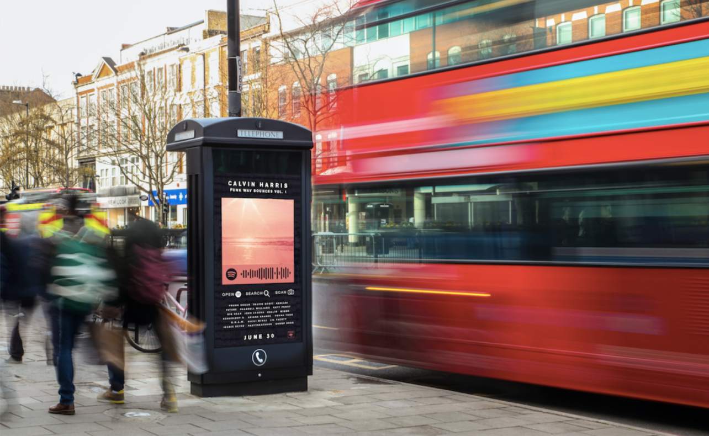
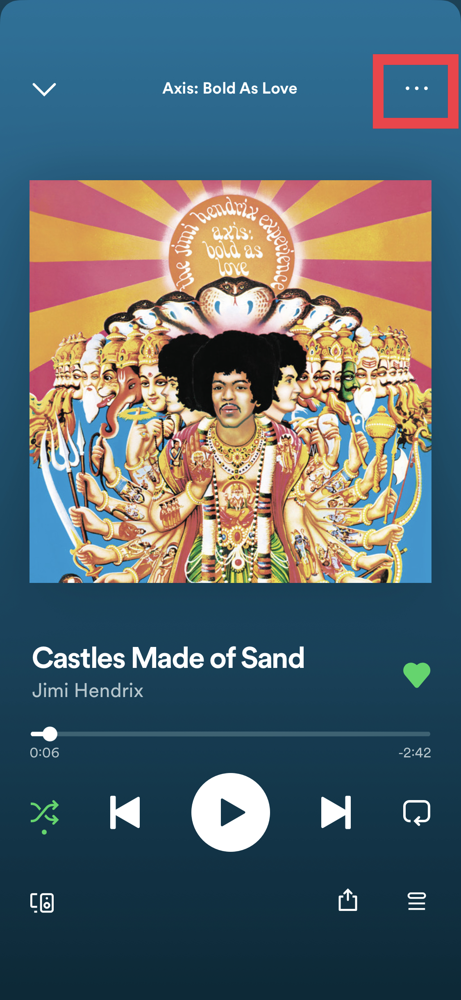
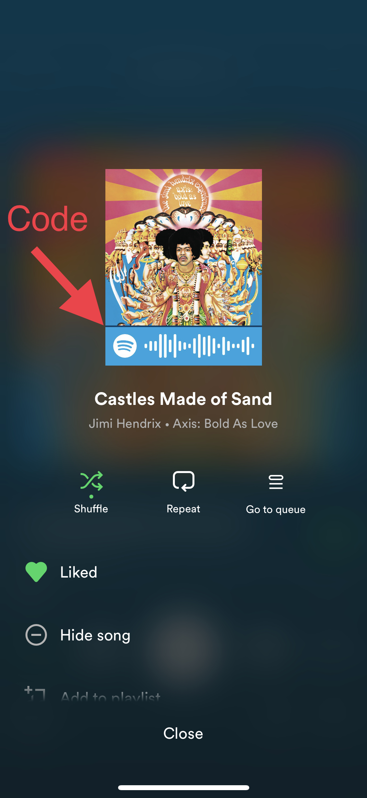
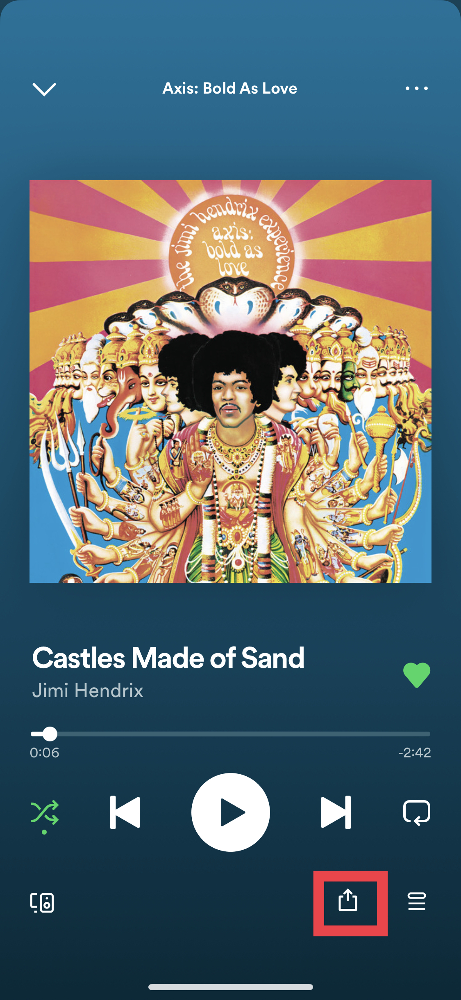
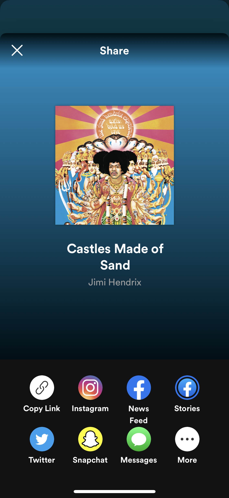

# Spotify Codes 
### By Sufiyan Syed - 2/25/22

Spotify in addition to Apple Music are both the most popular music streaming services in the industry today. As both these apps compete for market share, they are continually improving their unique app experiences. Spotify in particular has taken a personalized approach to Music streaming by giving users a yearly summary of their most listened to artists, songs, and albums that they can post on social media and share with others. Not only did this feature make the app more personal but increased social engagement with their app that allowed for music discovery. 

More recently in 2017, Spotfiy furthered this intiative by releasing “Spotify Codes'', a new way for users to share and discover content on Spotify. This feature essentially generates a unique code for every song, artist, and album on their platform which can be scanned by a QR like scanner in the app to direct you to that content. In this way, the features allow users to share and discover music with others and allows for the codes to be used for marketing purposes. 

 
 

    
  

 
 
However in the various **scenarios** where I thought of using this feature, it ends up having many usability issues. For example in physical contexts where I am with other people, I am not always able to get a hold of the code and having codes exchanged through a visual-recognition format offers a sometimes awkward experience. Instead of asking someone to scan a code on the app I often just ask that individual to share the song via text or social media. Furthermore if someone is playing a song not on the spotify platform or in a place you cannot access, the feature is completely **ineffective**. For this reason, this feature lacks **efficiency** resulting in it not being too **useful** that I often choose an alternative. 

 
 

For using this feature to share music digitally, I often overlook the feature because Spotify provides a traditional“share” button that requires less steps to access than the Code. This is another example of **inefficiency** as I would rather choose an alternative share content traditionally. Furthermore when sharing these codes on social media and coming across them, the Codes fail to perform like QR-codes that provide a pop-up notification easily directing you to the content. Instead the user has to download or screenshot the code and upload it to the spotify app to be directed to the Code. This is incredibly **inefficient** for what this feature aims to achieve and does not really provide any **use** to the user when he/she can just share and use a traditional link. 

Personally, I never find myself using this feature as it does not provide any increased **usefulness** or **efficiency** relative to competitors. I find Shazam’s audio-recognition format far more **efficient** for contexts when I want to discover and identify a song while I commonly use links to share music and discover music when no audio is being played. 

